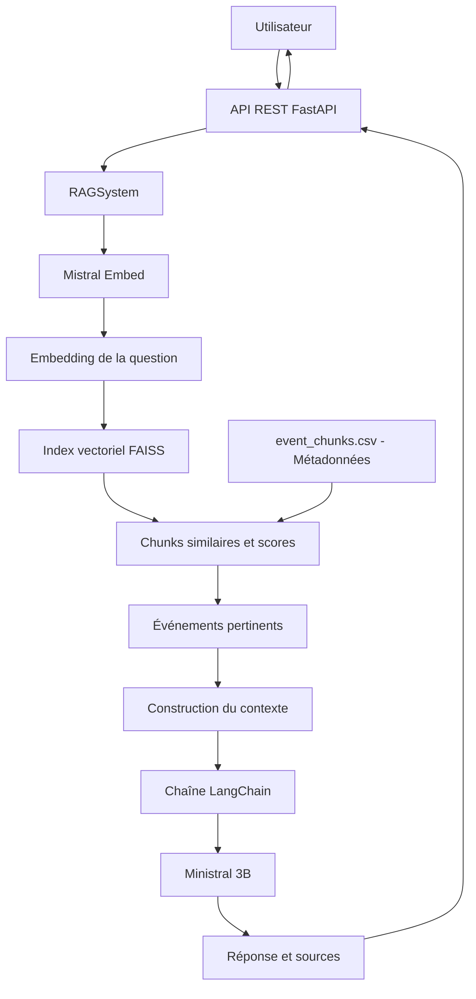

# Architecture du système RAG

Le système suit une architecture RAG (Retrieval-Augmented Generation) permettant de rechercher des événements culturels pertinents avant de générer une réponse en langage naturel.

## Rôle des composants

- **FastAPI** : expose le système RAG à travers une API REST.
- **RAGSystem** : orchestre la recherche des événements et la génération de la réponse.
- **Mistral Embed** : transforme la question utilisateur en vecteur sémantique.
- **FAISS** : recherche les événements sémantiquement proches de la question.
- **Métadonnées des événements** : fournissent les titres, dates, lieux, descriptions et URL associés aux résultats.
- **LangChain** : orchestre le prompt, le contexte récupéré et le modèle de génération.
- **Ministral 3B** : génère la réponse en langage naturel uniquement à partir du contexte fourni.
- **FastAPI** retourne finalement une réponse JSON contenant la réponse générée et les sources utilisées.