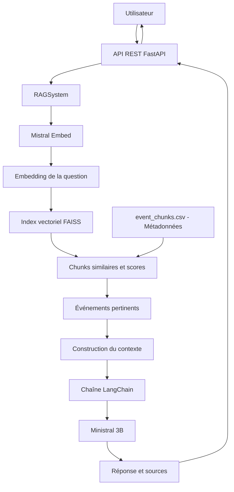

# Rapport technique – Assistant RAG de recommandation d'événements culturels

## 1. Contexte et objectif du projet

Dans le cadre de ce projet, Puls-Events souhaite étudier la faisabilité d'un assistant conversationnel capable de recommander des événements culturels à partir de données issues d'OpenAgenda.

L'objectif est de développer un Proof of Concept (POC) reposant sur une architecture RAG (*Retrieval-Augmented Generation*). Cette approche combine une recherche d'informations dans une base de connaissances avec un modèle de langage afin de produire des réponses contextualisées à partir des événements disponibles.

Le système développé doit permettre à un utilisateur de formuler une demande en langage naturel, par exemple :

> « Quels concerts de jazz sont disponibles à Paris ? »

Le système recherche alors les événements les plus pertinents dans la base de connaissances, construit un contexte à partir des résultats obtenus et utilise ce contexte pour générer une réponse en langage naturel.

Le périmètre retenu pour ce POC est centré sur les événements culturels situés à **Paris**.

Les principaux objectifs techniques sont :

- collecter et préparer les données d'événements issues d'OpenAgenda ;
- transformer les descriptions des événements en représentations vectorielles ;
- indexer et rechercher ces représentations avec FAISS ;
- construire une chaîne RAG combinant la recherche documentaire et la génération de texte ;
- exposer le système à travers une API REST ;
- évaluer la pertinence et la fiabilité des réponses produites ;
- conteneuriser l'application afin de faciliter son exécution et son déploiement.

## 2. Architecture du système

### 2.1 Vue d'ensemble

Le système repose sur une architecture RAG (*Retrieval-Augmented Generation*). Elle sépare la recherche des informations pertinentes de la génération de la réponse.

Lorsqu'un utilisateur envoie une question, celle-ci est d'abord transformée en vecteur sémantique. Ce vecteur est utilisé pour rechercher dans l'index FAISS les contenus les plus proches de la demande. Les événements retrouvés servent ensuite de contexte au modèle de langage, qui génère la réponse finale.

L'architecture générale du système est la suivante :



Une version dédiée de ce diagramme est également disponible dans `docs/architecture.md`.

### 2.2 Rôle des composants

Les principaux composants de l'architecture sont :

- **FastAPI** : expose le système RAG sous la forme d'une API REST et reçoit les questions des utilisateurs.
- **RAGSystem** : orchestre les différentes étapes de traitement d'une question.
- **Mistral Embed** : transforme la question utilisateur en un vecteur sémantique de 1 024 dimensions.
- **FAISS** : effectue la recherche vectorielle afin d'identifier les chunks les plus proches de la question.
- **event_chunks.csv** : contient les chunks textuels ainsi que les métadonnées permettant de reconstruire les informations des événements retrouvés.
- **LangChain** : orchestre le contexte récupéré, le prompt et le modèle de génération.
- **Ministral 3B** : génère la réponse en langage naturel à partir du contexte fourni.
- **FastAPI** retourne finalement au client une réponse JSON contenant la réponse générée ainsi que les sources utilisées.

### 2.3 Flux d'une requête utilisateur

Le traitement d'une question suit les étapes suivantes :

1. L'utilisateur transmet une question à l'endpoint `/ask` de l'API.

2. `RAGSystem` transmet la question à **Mistral Embed** afin d'obtenir sa représentation vectorielle.

3. Le vecteur obtenu est comparé aux vecteurs présents dans l'index **FAISS**.

4. Les chunks les plus similaires sont récupérés avec leurs scores de similarité.

5. Le système filtre les résultats afin de conserver les événements encore pertinents temporellement et évite de proposer plusieurs fois le même événement.

6. Les informations des événements sélectionnés sont regroupées afin de construire le contexte transmis au modèle de langage.

7. **LangChain** combine la question, le contexte et les instructions du prompt.

8. **Ministral 3B** génère une réponse à partir des informations contenues dans ce contexte.

9. L'API renvoie la réponse ainsi que les sources des événements utilisés.

Cette séparation entre recherche et génération permet de limiter la dépendance aux connaissances internes du modèle de langage. Le prompt demande au modèle de répondre à partir du contexte fourni, afin de réduire le risque de générer des informations qui ne proviennent pas de la base d'événements.

## 3. Préparation des données

### 3.1 Source des données

Les données utilisées pour constituer la base de connaissances du système proviennent du jeu de données public **OpenAgenda**, accessible via la plateforme Opendatasoft.

Pour limiter le périmètre du POC, les événements sont filtrés sur la ville de **Paris**. La collecte prend en compte les événements récents ainsi que les événements à venir.

Le script `scripts/fetch_events.py` automatise cette récupération. La date minimale est calculée dynamiquement afin de conserver environ une année d'historique tout en récupérant les événements futurs disponibles.

Cette approche permet d'éviter l'utilisation d'une date fixe qui rendrait progressivement la collecte obsolète.

### 3.2 Nettoyage et préparation

Les données brutes OpenAgenda contiennent de nombreux champs qui ne sont pas tous nécessaires au système de recommandation.

Le script `scripts/preprocess_events.py` effectue le prétraitement des événements afin de produire un jeu de données adapté au système RAG.

Les informations utiles conservées concernent notamment :

- le titre de l'événement ;
- sa description ;
- sa description détaillée lorsqu'elle est disponible ;
- les dates ;
- le lieu et l'adresse ;
- la ville et le code postal ;
- la catégorie ;
- les conditions d'accès ;
- les mots-clés ;
- l'URL de l'événement.

Les champs textuels utiles sont ensuite regroupés afin de constituer un contenu exploitable pour la recherche sémantique.

Après nettoyage, le jeu de données contient environ **9 700 événements** exploitables pour le POC.

### 3.3 Construction des chunks

Les descriptions d'événements peuvent contenir des textes relativement longs. Afin d'améliorer la précision de la recherche sémantique, les documents sont découpés en morceaux de texte appelés **chunks**.

Le script `scripts/chunk_events.py` réalise ce découpage avec les paramètres suivants :

- taille maximale d'un chunk : **1 200 caractères** ;
- chevauchement entre deux chunks successifs : **200 caractères**.

Le chevauchement permet de conserver une partie du contexte lorsqu'une information se trouve à la frontière entre deux chunks.

À l'issue de cette étape, environ **15 395 chunks** sont obtenus.

Chaque chunk reste associé aux métadonnées de son événement d'origine, notamment son titre, ses dates, son lieu et son URL. Cette association permet de retrouver les informations complètes de l'événement après une recherche vectorielle.

Les chunks préparés sont enregistrés dans `data/event_chunks.csv`.

### 3.4 Préparation pour la vectorisation

Chaque chunk est ensuite transformé en représentation vectorielle à l'aide du modèle **Mistral Embed**.

Ces embeddings permettent de représenter le sens du texte sous forme numérique. Deux textes sémantiquement proches peuvent ainsi avoir des représentations vectorielles proches même s'ils n'utilisent pas exactement les mêmes mots.

Les vecteurs générés sont ensuite utilisés pour construire l'index FAISS exploité par le système RAG.

## 4. Recherche vectorielle

### 4.1 Génération des embeddings avec Mistral Embed

La recherche sémantique nécessite de transformer les textes en représentations numériques appelées **embeddings**.

Le modèle `mistral-embed` a été utilisé pour vectoriser les chunks issus des descriptions d'événements ainsi que les questions formulées par les utilisateurs.

Chaque texte est représenté par un vecteur de **1 024 dimensions**.

Le choix d'un modèle d'embedding permet d'effectuer une recherche basée sur la proximité sémantique plutôt que sur la simple présence de mots-clés. Une question peut ainsi retrouver un événement pertinent même si les termes employés par l'utilisateur ne sont pas exactement ceux présents dans sa description.

Les embeddings des chunks sont générés en amont et conservés localement afin d'éviter de recalculer l'ensemble des vecteurs à chaque requête.

### 4.2 Indexation avec FAISS

Les embeddings sont indexés avec **FAISS** (*Facebook AI Similarity Search*).

FAISS a été retenu pour ce POC car il permet d'effectuer efficacement des recherches de similarité sur des ensembles de vecteurs et peut fonctionner localement sans nécessiter la mise en place d'une base de données vectorielle externe.

L'index utilisé est :

`IndexFlatIP`

Cet index réalise une recherche exacte basée sur le produit scalaire (*Inner Product*).

Avant leur indexation et leur comparaison, les vecteurs sont normalisés avec la norme L2. Avec des vecteurs normalisés, le produit scalaire permet d'obtenir une mesure équivalente à la similarité cosinus.

Cette approche fournit un fonctionnement simple et déterministe, adapté à la taille du jeu de données utilisé dans ce POC.

L'index obtenu est enregistré dans :

`data/chunks.index`

Les métadonnées correspondantes sont conservées dans :

`data/event_chunks.csv`

### 4.3 Recherche des événements pertinents

Lorsqu'une question est reçue, elle est d'abord transformée en embedding avec le même modèle `mistral-embed` que celui utilisé pour les chunks.

Le vecteur de la question est normalisé puis envoyé à FAISS afin de rechercher les chunks présentant la plus forte similarité.

Le système récupère initialement davantage de résultats que le nombre finalement présenté à l'utilisateur. Cette stratégie permet d'appliquer ensuite des règles métier supplémentaires.

Les résultats sont notamment :

- filtrés selon leur pertinence temporelle afin d'éviter de recommander des événements déjà terminés ;
- dédupliqués afin d'éviter qu'un même événement apparaisse plusieurs fois lorsque plusieurs de ses chunks sont retrouvés ;
- classés selon leur score de similarité.

Les événements les plus pertinents sont ensuite utilisés pour construire le contexte transmis au modèle de génération.

### 4.4 Choix et limites de la stratégie de recherche

L'utilisation de FAISS avec `IndexFlatIP` présente plusieurs avantages pour ce POC :

- recherche vectorielle locale et rapide ;
- absence de service externe supplémentaire à administrer ;
- recherche exacte sur les vecteurs indexés ;
- architecture simple à reproduire ;
- intégration adaptée à un prototype de taille limitée.

Cette approche présente cependant certaines limites.

FAISS retourne les vecteurs les plus proches même lorsque la question est éloignée du périmètre métier. Un score de similarité ne garantit donc pas à lui seul qu'un événement constitue une bonne réponse à la demande de l'utilisateur.

Cette limite est notamment visible avec les questions volontairement hors périmètre utilisées pendant l'évaluation. Elle justifie l'utilisation d'autres mécanismes complémentaires, tels que les instructions du prompt, la génération contextualisée et l'évaluation métier des réponses.

Pour un système à plus grande échelle, des stratégies supplémentaires pourraient être étudiées, par exemple l'utilisation d'un seuil minimal de similarité, d'un reranking des résultats ou d'une base vectorielle adaptée à un volume de données plus important.

## 5. Génération des réponses

### 5.1 Modèle de génération

La génération des réponses est réalisée avec le modèle **Ministral 3B** (`ministral-3b-2512`) via l'API Mistral.

Ce modèle intervient après l'étape de recherche vectorielle : il ne sélectionne pas directement les événements dans l'ensemble de la base. Son rôle est de transformer les informations récupérées par le système RAG en une réponse compréhensible pour l'utilisateur.

Dans le cadre de ce POC, ce modèle a été retenu car il permet d'utiliser un modèle de génération Mistral compatible avec les ressources API disponibles pour le projet.

Le modèle d'embedding et le modèle de génération ont donc deux fonctions distinctes :

- `mistral-embed` transforme les textes et les questions en vecteurs pour la recherche sémantique ;
- `ministral-3b-2512` génère la réponse finale en langage naturel.

### 5.2 Orchestration avec LangChain

**LangChain** est utilisé pour orchestrer la phase de génération.

Après la recherche FAISS, les informations des événements sélectionnés sont regroupées afin de construire un contexte contenant notamment leurs titres, dates, lieux, descriptions et URL.

La chaîne LangChain combine ensuite :

1. la question de l'utilisateur ;
2. le contexte récupéré par le système RAG ;
3. les instructions définies dans le prompt ;
4. le modèle de génération Ministral 3B.

Cette organisation sépare clairement la phase de récupération de l'information (*retrieval*) de la phase de génération (*generation*).

### 5.3 Construction du prompt

Le prompt a été conçu pour demander au modèle de répondre à partir des informations contenues dans le contexte récupéré.

Cette contrainte est importante dans un système RAG : le modèle ne doit pas inventer un événement absent des données fournies simplement parce qu'il possède des connaissances générales.

Le contexte transmis au modèle est construit à partir des résultats de la recherche vectorielle et contient les informations nécessaires pour présenter les événements retrouvés.

Le système peut également traiter une demande qui ne correspond pas au périmètre métier du POC. Par exemple, une demande de recommandation de restaurant ne correspond pas à un assistant consacré aux événements culturels parisiens.

### 5.4 Réduction du risque d'hallucination

L'architecture mise en place cherche à réduire le risque d'hallucination en combinant plusieurs mécanismes :

- récupération préalable des informations dans la base de connaissances ;
- génération à partir du contexte récupéré ;
- instructions explicites dans le prompt ;
- retour des sources utilisées avec la réponse ;
- limitation du périmètre métier aux événements culturels étudiés dans le POC.

Ces mécanismes réduisent le risque d'informations non fondées, mais ne garantissent pas l'absence totale d'hallucinations.

Cette limite est prise en compte dans l'évaluation du système, notamment avec la métrique **Faithfulness** de RAGAS, qui mesure dans quelle mesure les affirmations de la réponse sont soutenues par le contexte fourni.

### 5.5 Réponse et traçabilité des sources

Le système ne retourne pas uniquement le texte généré.

La méthode `ask()` fournit également les informations utilisées pour construire la réponse, notamment les sources des événements récupérés.

Chaque source peut contenir des informations telles que :

- le titre de l'événement ;
- sa date ;
- son lieu ;
- son URL ;
- son score de similarité.

Cette traçabilité permet d'associer la réponse générée aux événements provenant de la base de connaissances et facilite l'analyse du comportement du système.

## 6. API REST

### 6.1 Exposition du système avec FastAPI

Le système RAG est exposé sous la forme d'une **API REST développée avec FastAPI**.

L'API constitue l'interface entre une application cliente et le système RAG. Elle permet d'envoyer une question en langage naturel et de récupérer une réponse structurée au format JSON.

FastAPI a été retenu pour sa simplicité d'intégration avec Python, sa gestion de la validation des données et la génération automatique d'une documentation interactive avec Swagger.

Le point d'entrée de l'application se trouve dans :

`app/main.py`

### 6.2 Endpoints disponibles

L'API expose les endpoints principaux suivants :

| Méthode | Endpoint | Rôle |
|---|---|---|
| `GET` | `/` | Vérifier l'accès à l'API et présenter le service. |
| `GET` | `/health` | Vérifier que l'API est opérationnelle. |
| `POST` | `/ask` | Envoyer une question au système RAG et obtenir une réponse accompagnée de ses sources. |
| `POST` | `/rebuild` | Reconstruire les données et l'index utilisés par le système RAG. |

L'endpoint `/ask` constitue le point d'entrée principal pour l'utilisation métier du système.

Il reçoit une question utilisateur, exécute la chaîne RAG puis retourne une réponse JSON contenant notamment la réponse générée et les sources utilisées.

### 6.3 Validation des données

Les schémas d'entrée et de sortie sont définis avec **Pydantic** dans :

`app/schemas.py`

Cette validation permet de contrôler la structure des données échangées avec l'API avant leur traitement par le système RAG.

Elle facilite également la documentation automatique des requêtes et réponses dans Swagger.

### 6.4 Gestion des erreurs

Une gestion des erreurs a été ajoutée afin d'éviter qu'une erreur provenant d'un service externe ne provoque une réponse incompréhensible pour le client de l'API.

Les erreurs liées aux appels vers l'API Mistral sont notamment interceptées.

Lorsqu'une limite de quota ou de débit est rencontrée, l'API peut retourner un code HTTP `429`.

D'autres erreurs provenant du service externe peuvent être converties en réponse HTTP `503`, indiquant que le service nécessaire au fonctionnement du RAG est temporairement indisponible.

Cette gestion permet de distinguer une erreur du système RAG d'une indisponibilité ou d'une limitation d'un service externe.

### 6.5 Documentation et test de l'API

FastAPI génère automatiquement une interface Swagger permettant de consulter et de tester les endpoints.

Après le lancement local de l'application, cette interface est disponible sur :

`http://localhost:8000/docs`

Elle permet notamment de tester `/ask` en saisissant directement une question et d'observer la réponse JSON retournée.

L'endpoint `/health` peut également être utilisé pour vérifier rapidement que le service est opérationnel.

### 6.6 Limite de l'endpoint de reconstruction

L'endpoint `/rebuild` est adapté au contexte de ce POC local, mais sa reconstruction peut être longue et consommer des appels vers l'API d'embedding.

Dans une mise en production, cet endpoint devrait être protégé et réservé à un usage d'administration. Une reconstruction asynchrone ou exécutée par une tâche dédiée serait également préférable afin de ne pas bloquer l'API pendant cette opération.

## 7. Évaluation du système

### 7.1 Jeu de questions d'évaluation

Un jeu de **10 questions** a été constitué dans `evaluation_questions.csv` afin d'évaluer le comportement du système sur plusieurs types de demandes.

Les questions couvrent différents cas d'utilisation :

- recherche de concerts ;
- recherche d'expositions ;
- activités familiales ;
- événements dans un musée ;
- spectacles ;
- événements gratuits ;
- demandes comportant une contrainte temporelle ;
- demande volontairement hors périmètre.

Parmi les questions utilisées figurent par exemple :

> « Quels concerts de jazz sont disponibles à Paris ? »

> « Que puis-je faire à Paris ce week-end ? »

> « Peux-tu me recommander un restaurant japonais à Lyon ? »

La dernière question constitue volontairement un cas hors périmètre afin de vérifier le comportement du système face à une demande ne concernant pas les événements culturels parisiens.

### 7.2 Évaluation humaine

Une première évaluation manuelle a été réalisée sur les 10 questions du jeu de test.

Les réponses ont été examinées selon leur cohérence avec la demande utilisateur et les événements proposés.

Les résultats obtenus sont :

| Résultat | Nombre | Proportion |
|---|---:|---:|
| Réponses correctes | 9 | 90 % |
| Réponses partielles | 1 | 10 % |
| Réponses incorrectes | 0 | 0 % |

Cette évaluation apporte une lecture métier du comportement du système et complète les métriques automatiques.

### 7.3 Évaluation automatique avec RAGAS

Une seconde évaluation a été réalisée avec **RAGAS** afin de mesurer automatiquement deux dimensions du système :

- **Faithfulness** : mesure dans quelle mesure les affirmations de la réponse sont soutenues par le contexte récupéré ;
- **Answer Relevancy** : mesure la pertinence de la réponse par rapport à la question posée.

Le script `evaluate_ragas.py` automatise cette évaluation à partir du jeu de questions.

Sur les 10 questions, **8 ont pu être évaluées complètement avec RAGAS**.

Deux évaluations ont rencontré une limite technique liée à la longueur maximale de sortie (`max_tokens`) pendant le calcul des métriques. Ces deux cas sont conservés dans les résultats comme erreurs techniques plutôt que d'être artificiellement considérés comme des scores nuls.

Les moyennes calculées sur les **8 évaluations RAGAS abouties** sont :

| Métrique | Moyenne |
|---|---:|
| Faithfulness | **0,694** |
| Answer Relevancy | **0,642** |

Ces moyennes doivent être interprétées avec prudence et ne constituent pas à elles seules une mesure globale de la qualité du système.

### 7.4 Analyse de l'Answer Relevancy

La moyenne d'Answer Relevancy de **0,642** masque une distribution particulière des résultats.

Sur les 8 questions évaluées :

- 6 obtiennent un score compris entre environ **0,816 et 0,916** ;
- la question portant sur une activité culturelle en septembre obtient un score de **0** ;
- la question volontairement hors périmètre concernant un restaurant japonais à Lyon obtient également un score de **0**.

Les six questions correspondant aux cas classiques présentent donc des scores d'Answer Relevancy relativement homogènes et élevés.

Le score nul obtenu pour la question hors périmètre met également en évidence une limite de l'utilisation d'une métrique automatique générique : un refus ou une réponse destinée à signaler qu'une demande ne correspond pas au périmètre métier peut être pénalisé par la métrique alors que ce comportement peut être approprié du point de vue métier.

L'évaluation automatique est donc utilisée en complément, et non en remplacement, de l'évaluation humaine.

### 7.5 Analyse de la Faithfulness

La moyenne de Faithfulness obtenue est de **0,694** sur les 8 évaluations abouties.

Les scores sont plus variables que ceux d'Answer Relevancy sur les cas classiques. Certaines réponses obtiennent un score de `1`, tandis que d'autres présentent des valeurs plus faibles.

Ce résultat indique que la pertinence d'une réponse par rapport à une question et sa fidélité exacte au contexte sont deux dimensions différentes.

Le prompt et l'architecture RAG permettent de réduire le risque d'informations non soutenues par le contexte, mais l'évaluation montre que ce risque n'est pas totalement supprimé.

Cette observation constitue une piste d'amélioration importante du système.

### 7.6 Évaluation de la recherche vectorielle

Le système enregistre également le score de similarité des résultats retournés par FAISS.

Pour les **8 questions disposant d'un score enregistré dans le fichier d'évaluation**, la similarité moyenne est :

**0,774**

Les valeurs observées sont relativement regroupées, avec des scores allant approximativement de **0,707 à 0,817**.

Il est important de noter que les deux valeurs manquantes dans le fichier de résultats ne démontrent pas un échec de FAISS. Elles correspondent aux deux exécutions ayant rencontré une erreur pendant l'étape d'évaluation RAGAS, et la première version du script n'avait pas conservé séparément le score FAISS lorsque cette erreur survenait.

Le script d'évaluation a depuis été corrigé afin de conserver le score de similarité lorsqu'il a déjà été calculé avant une éventuelle erreur RAGAS.

### 7.7 Synthèse de l'évaluation

Les différentes méthodes d'évaluation apportent des informations complémentaires :

| Évaluation | Résultat |
|---|---|
| Évaluation humaine | **9 réponses correctes, 1 partielle, 0 incorrecte** |
| RAGAS – couverture | **8 questions évaluées sur 10** |
| RAGAS – Faithfulness moyenne | **0,694** |
| RAGAS – Answer Relevancy moyenne | **0,642** |
| FAISS – similarité moyenne enregistrée | **0,774 sur 8 résultats disponibles** |

Les résultats montrent l'intérêt de ne pas évaluer le système RAG avec une seule métrique.

L'évaluation humaine permet d'apprécier la qualité métier des réponses, RAGAS analyse automatiquement leur pertinence et leur fidélité au contexte, tandis que le score FAISS apporte une information sur la proximité sémantique des documents récupérés.

Les résultats mettent également en évidence plusieurs axes d'amélioration : mieux gérer les demandes hors périmètre, renforcer la fidélité des réponses au contexte et améliorer le traitement des requêtes temporelles.

## 8. Tests automatisés

### 8.1 Objectif des tests

Des tests automatisés ont été mis en place afin de vérifier le fonctionnement des principaux composants du système RAG et de l'API.

Les tests permettent notamment de détecter une régression après une modification du code sans avoir à effectuer manuellement l'ensemble des vérifications.

Ils sont exécutés avec **pytest**.

Les fichiers de tests sont regroupés dans le répertoire :

`tests/`

### 8.2 Tests de l'API

Le fichier `tests/test_api.py` vérifie le comportement de l'API FastAPI.

Les tests couvrent notamment les endpoints exposés par l'application et permettent de vérifier que les réponses HTTP et les données retournées respectent le comportement attendu.

Les appels vers les services externes peuvent être simulés dans les tests afin de tester l'API sans dépendre systématiquement d'un appel réel vers Mistral.

Cette approche rend les tests plus rapides, reproductibles et indépendants du quota de l'API externe.

### 8.3 Tests du système RAG

Le fichier `tests/test_rag_system.py` vérifie différents comportements du système RAG.

Ces tests permettent notamment de contrôler la logique de récupération et de traitement des résultats avant la génération de la réponse.

Une attention particulière est portée aux comportements pouvant évoluer avec le temps. Les dates utilisées dans les tests sont générées relativement à la date d'exécution plutôt que d'utiliser uniquement des dates fixes qui pourraient rendre certains tests obsolètes.

### 8.4 Exécution des tests

L'ensemble des tests peut être exécuté depuis la racine du projet avec la commande :

```bash
pytest

## 9. Conteneurisation avec Docker

### 9.1 Objectif de la conteneurisation

L'application a été conteneurisée avec **Docker** afin de fournir un environnement d'exécution reproductible et indépendant de l'environnement Python installé sur la machine hôte.

Le conteneur regroupe notamment :

- l'API FastAPI ;
- le système RAG ;
- les dépendances Python nécessaires ;
- l'index FAISS ;
- les métadonnées associées aux chunks.

Les secrets, notamment la clé API Mistral, ne sont pas intégrés directement dans l'image Docker.

### 9.2 Construction de l'image

La configuration du conteneur est définie dans le fichier :

`Dockerfile`

Une liste de dépendances spécifique au conteneur est disponible dans :

`requirements-docker.txt`

L'image peut être construite depuis la racine du projet avec :

```bash
docker build -t rag-events-api .
```

Le fichier `.dockerignore` évite d'envoyer dans l'image les fichiers inutiles ou sensibles, notamment les environnements virtuels, les caches, le dépôt Git et le fichier `.env`.

Les fichiers nécessaires au fonctionnement du système, tels que `event_chunks.csv` et `chunks.index`, sont en revanche intégrés à l'image.

### 9.3 Lancement du conteneur

L'API peut être lancée avec :

```bash
docker run --rm -p 8000:8000 \
  --env-file .env \
  rag-events-api
```

Le fichier `.env` est ainsi fourni au moment de l'exécution et n'est pas enregistré dans l'image.

L'API devient ensuite accessible localement sur le port `8000`.

La documentation Swagger peut être consultée à l'adresse :

`http://localhost:8000/docs`

### 9.4 Validation du conteneur

L'image Docker a été construite et testée localement.

L'endpoint `/health` a retourné une réponse HTTP `200` avec :

```json
{
  "status": "ok"
}
```

Un test de bout en bout a également permis de valider la chaîne complète :

**Docker → FastAPI → Mistral Embed → FAISS → construction du contexte → Ministral 3B → réponse et sources**

Ce test permet de vérifier que l'application conteneurisée ne se limite pas au démarrage de l'API, mais qu'elle est également capable d'exécuter une requête RAG complète.

### 9.5 Limites du déploiement actuel

La conteneurisation rend l'application reproductible et facilite son déploiement, mais le projet reste un **POC exécuté et validé localement**.

Le Dockerfile constitue la base nécessaire à un futur déploiement sur une plateforme distante, mais aucun déploiement public permanent n'est revendiqué dans le cadre de cette version du projet.

Une évolution vers un environnement de production nécessiterait notamment une gestion sécurisée des secrets, une protection des opérations d'administration, une stratégie de mise à jour de l'index et des mécanismes supplémentaires de supervision.

## 10. Limites du POC

Le POC démontre le fonctionnement complet d'une architecture RAG appliquée à la recommandation d'événements culturels. Plusieurs limites ont néanmoins été identifiées pendant son développement et son évaluation.

### 10.1 Gestion des requêtes temporelles

Le système filtre les résultats afin de ne pas recommander des événements déjà terminés.

Cette stratégie est adaptée aux recommandations d'événements à venir, mais elle limite la capacité du système à répondre à une question portant explicitement sur un événement historique.

Les contraintes temporelles formulées en langage naturel, comme « ce week-end », « demain » ou « en septembre », constituent également un axe d'amélioration. La recherche vectorielle seule n'est pas conçue pour interpréter précisément toutes les contraintes de dates.

### 10.2 Requêtes hors périmètre

FAISS retourne les vecteurs les plus proches de la question, même lorsqu'aucun document ne correspond réellement au besoin métier.

Une question hors périmètre peut donc malgré tout produire des résultats vectoriels.

Le prompt permet au modèle de limiter ce comportement au moment de la génération, mais une détection explicite des demandes hors périmètre rendrait le système plus robuste.

### 10.3 Absence de seuil minimal de similarité

Les résultats FAISS sont actuellement classés selon leur similarité, mais le système ne repose pas sur un seuil métier validé permettant de considérer qu'un résultat est suffisamment pertinent.

Un résultat peut donc être sélectionné simplement parce qu'il est le plus proche parmi les documents disponibles.

### 10.4 Fidélité au contexte

L'évaluation RAGAS a obtenu une Faithfulness moyenne de **0,694** sur les huit évaluations automatiques abouties.

Ce résultat montre que l'utilisation d'une architecture RAG et d'un prompt contraignant réduit le risque d'informations non soutenues par le contexte, mais ne le supprime pas totalement.

### 10.5 Dépendance à l'API Mistral

La génération des embeddings et des réponses dépend de l'API Mistral.

Le fonctionnement du système peut donc être affecté par :

- les quotas d'utilisation ;
- les limitations de débit ;
- une indisponibilité du service ;
- l'évolution des modèles proposés.

Une gestion des erreurs HTTP a été ajoutée à l'API, mais cette dépendance externe reste une limite du POC.

### 10.6 Reconstruction de l'index

L'endpoint `/rebuild` déclenche une opération potentiellement longue et consommatrice d'appels API.

Dans le POC, cette opération est synchrone et n'est pas protégée par un mécanisme d'authentification.

Ce fonctionnement est acceptable pour une démonstration locale, mais ne serait pas adapté tel quel à un environnement de production.

### 10.7 Limites de l'évaluation automatique

RAGAS a permis d'évaluer complètement **8 questions sur 10**.

Deux évaluations ont rencontré une limite technique liée à la longueur maximale de sortie pendant le calcul des métriques.

De plus, certaines métriques automatiques peuvent pénaliser un comportement pourtant cohérent avec les règles métier. C'est notamment le cas d'une demande volontairement hors périmètre.

Pour cette raison, les métriques automatiques ont été complétées par une évaluation humaine.


## 11. Pistes d'amélioration

Plusieurs évolutions pourraient améliorer la robustesse et la qualité du système.

### 11.1 Améliorer le traitement des dates

Une étape spécifique d'analyse des contraintes temporelles pourrait être ajoutée avant la recherche vectorielle.

Le système pourrait par exemple extraire une période structurée à partir d'expressions telles que « ce week-end », « demain » ou « le mois prochain », puis appliquer cette période directement aux métadonnées des événements.

### 11.2 Ajouter une détection du hors périmètre

Une étape de classification pourrait déterminer si la demande concerne réellement un événement culturel couvert par le système avant d'effectuer la génération.

Cela permettrait d'éviter de traiter comme pertinentes des demandes telles qu'une recherche de restaurant dans une autre ville.

### 11.3 Définir un seuil de similarité

Une expérimentation sur un jeu de questions annotées permettrait de déterminer un seuil minimal de similarité.

En dessous de ce seuil, le système pourrait indiquer qu'aucun événement suffisamment pertinent n'a été trouvé plutôt que de retourner systématiquement les résultats les plus proches.

### 11.4 Ajouter une étape de reranking

Après la recherche FAISS, un mécanisme de **reranking** pourrait réévaluer les résultats récupérés avant la construction du contexte.

Cette étape permettrait de combiner la similarité sémantique avec d'autres critères métier, par exemple la date, la catégorie ou la localisation.

### 11.5 Renforcer la fidélité des réponses

Le prompt pourrait être amélioré afin de contraindre davantage la génération aux informations présentes dans le contexte.

Des tests supplémentaires pourraient également être ajoutés pour identifier les types de questions produisant les scores de Faithfulness les plus faibles.

### 11.6 Sécuriser les opérations d'administration

Dans une version destinée à la production, `/rebuild` devrait être protégé par une authentification et ne devrait pas bloquer directement le traitement des requêtes utilisateur.

La reconstruction de l'index pourrait être exécutée en tâche de fond puis remplacer l'ancien index une fois l'opération terminée.

### 11.7 Enrichir l'évaluation

Le jeu actuel de 10 questions permet de valider le POC, mais une évaluation plus complète nécessiterait un jeu de données plus important et davantage de cas annotés.

Il serait notamment intéressant d'ajouter :

- plusieurs formulations d'une même intention ;
- davantage de contraintes temporelles ;
- des demandes ambiguës ;
- davantage de questions hors périmètre ;
- des cas pour lesquels aucun événement pertinent n'existe.

Cette extension permettrait de mieux mesurer la robustesse du système et de comparer différentes configurations du pipeline RAG.

## 12. Conclusion

Ce projet a permis de concevoir et de valider un POC complet d'assistant de recommandation d'événements culturels reposant sur une architecture RAG.

Le système développé couvre l'ensemble de la chaîne nécessaire au fonctionnement de l'assistant : collecte et préparation des données OpenAgenda, découpage des contenus, génération d'embeddings avec Mistral Embed, indexation et recherche vectorielle avec FAISS, génération contextualisée avec LangChain et Ministral 3B, exposition du service avec FastAPI et conteneurisation avec Docker.

L'évaluation du système combine plusieurs approches complémentaires. L'évaluation humaine a obtenu **9 réponses correctes et 1 réponse partielle sur 10 questions**, tandis que l'évaluation automatique avec RAGAS a permis d'analyser la pertinence et la fidélité au contexte sur 8 questions. Les scores de similarité FAISS apportent également une mesure de la qualité de la recherche vectorielle.

Les résultats montrent que le POC est capable de rechercher des événements culturellement pertinents et de produire des réponses contextualisées accompagnées de leurs sources. Ils mettent également en évidence plusieurs limites, notamment dans la gestion des contraintes temporelles, des demandes hors périmètre et de la fidélité des réponses au contexte.

Ces limites constituent des pistes d'amélioration pour une évolution du POC vers un système plus robuste, notamment par l'ajout d'un traitement structuré des dates, d'un seuil de pertinence, d'une détection des demandes hors périmètre et d'une stratégie de reranking.

Le projet démontre ainsi la faisabilité technique d'un assistant RAG appliqué à la recommandation d'événements culturels, tout en identifiant clairement les travaux nécessaires avant une éventuelle utilisation en production.